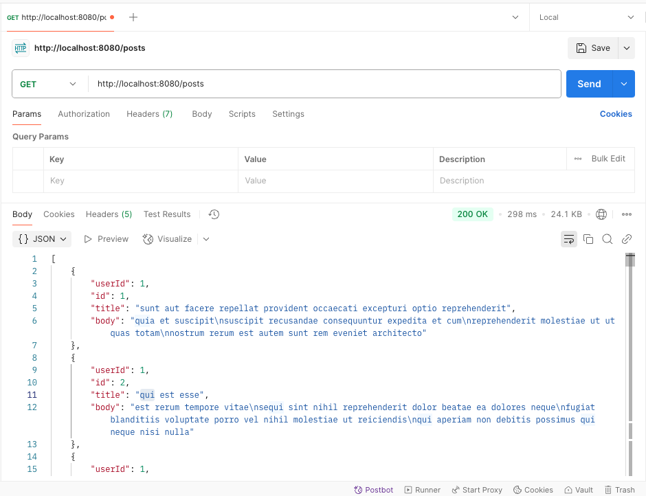
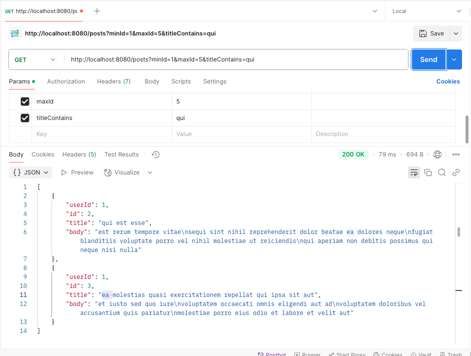
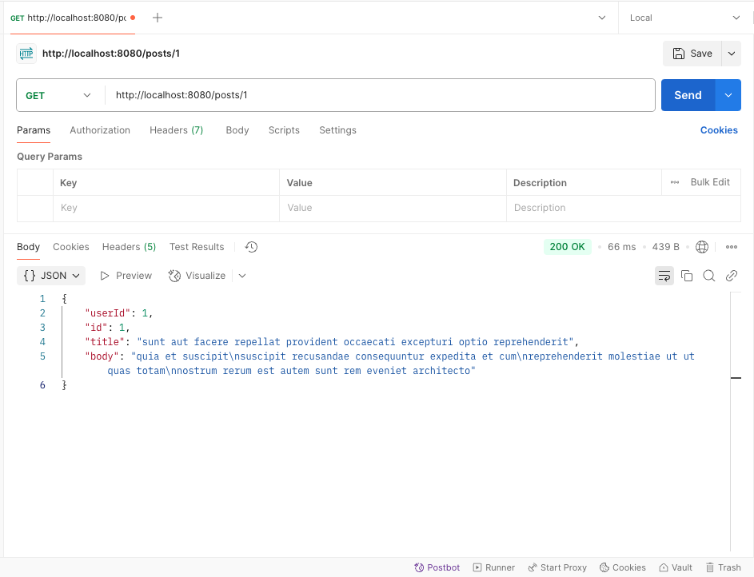
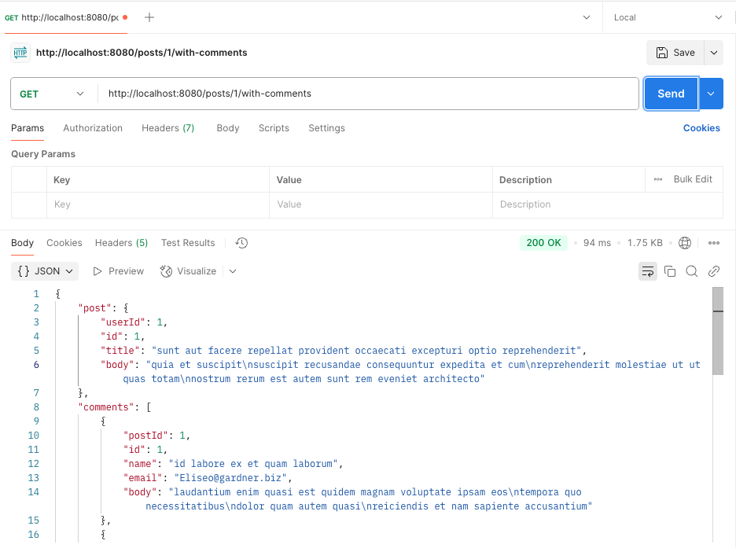
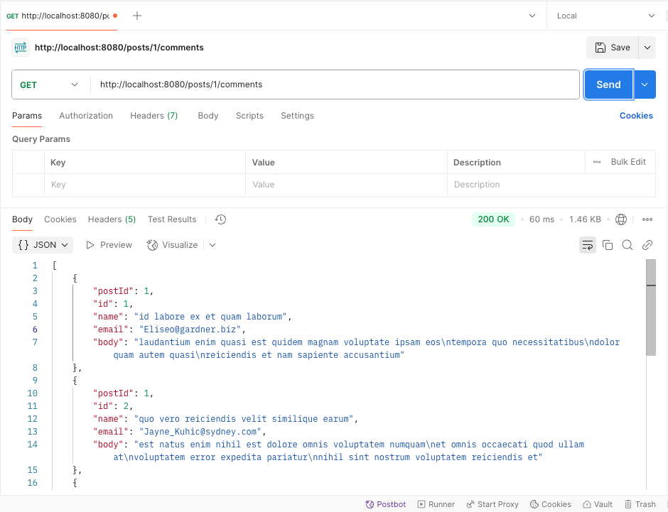

# Audition API

A Spring Boot application built as part of a coding assessment. It demonstrates clean architecture, API error handling,
logging, unit testing, and observability integrations.

---

## ✅ Features

- REST API for interacting with mock post and comment data
- Clean service and client architecture
- Global exception handling using `@ControllerAdvice`
- Structured logging and tracing
- Configurable external API URLs via YAML
- 80%+ test coverage with JUnit and Mockito
- Code quality tools: PMD, SpotBugs, Checkstyle, JaCoCo

---

## 📦 Technologies Used

- Java 17
- Spring Boot 3.x
- Spring Web, Spring MVC
- JUnit 5, Mockito
- Jackson (custom `ObjectMapper`)
- Micrometer Tracing (optional)
- SpotBugs, PMD, Checkstyle
- IntelliJ IDEA for coverage reports

---

## 🚀 How to Run the App

```bash
./gradlew clean build
./gradlew bootRun

```

## 📡 Available API Endpoints

### 🔹 `GET /posts`

Fetch all posts, supports filtering by `minId`, `maxId`, and `titleContains`.



---

### 🔹 `GET /posts/{id}`

Fetch a post by ID.



---

### 🔹 `GET /posts/{id}/with-comments`

Fetch a post with its comments embedded.

📸 _Screenshot here_

---

### 🔹 `GET /comments?postId={id}`

Fetch only the comments for a specific post ID.

📸 _Screenshot here_
